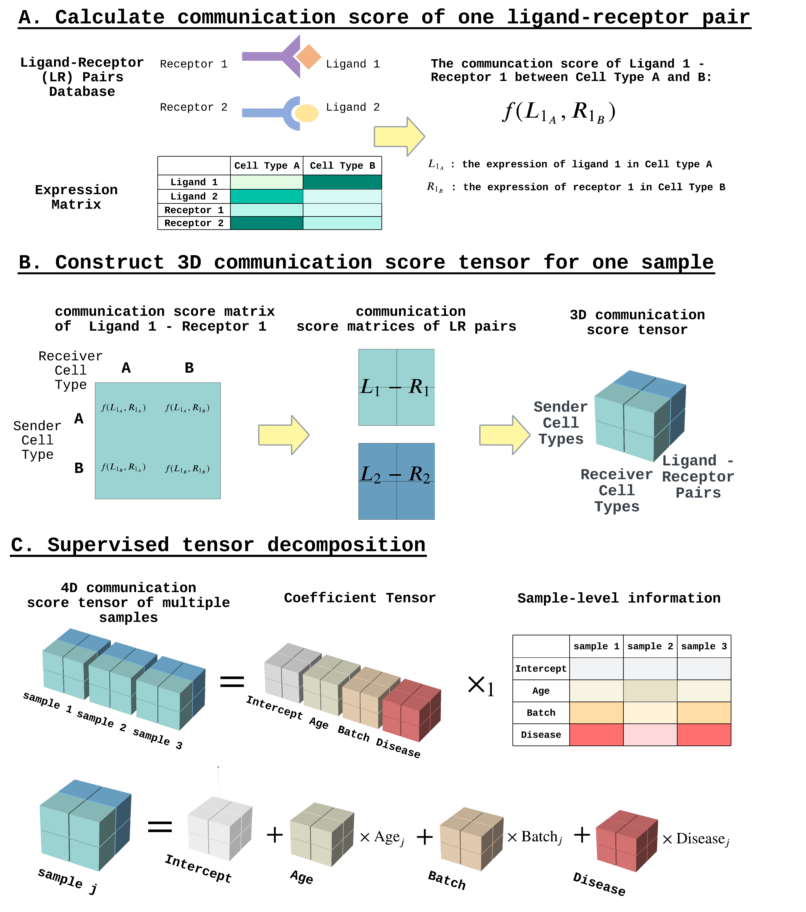

# STACCato
Supervised Tensor Analysis tool for studying Cell-cell Communication using scRNA-seq data across multiple samples and conditions.

- (1) construct 4-dimensional communication score tensor using multi-sample multi-condition scRNA-seq data; 
- (2) perform supervised tensor decomposition to estimate the effects of conditions on CCC events and infer activity patterns of cell types; 
- (3) use bootstrapping resampling to assess the significance level of the estimated effects; 
- (4) conduct downstream analyses including comparing significant CCC events across cell types and identify pathways significantly associated with conditions. 

## Tutorials

- Analysis of SLE scRNA-seq data
  - [scRNA-seq data preprocessing](Examples/SLE/Scripts/0_preproceesing.ipynb)
  - [use Tensor-cell2cell to build communication score tensor](Examples/SLE/Scripts/1_build_communication_score_tensor.ipynb)
  - [STACCato decomposition and bootstrapping](https://htmlpreview.github.io/?https://raw.githubusercontent.com/daiqile96/STACCato/main/Examples/SLE/Scripts/dcomp.html)

